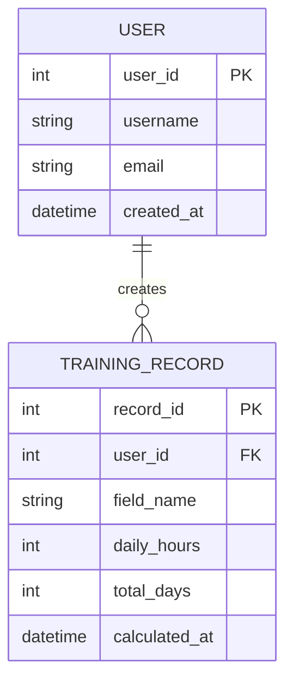
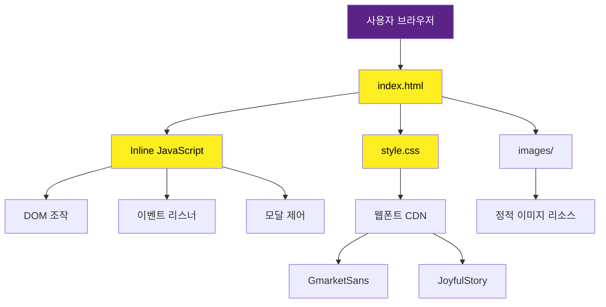

# 1만 시간의 법칙 (10,000 Hours Rule)

## 0. 안내

이 저장소는 **모두의 연구소 프론트엔드 1차 미니 프로젝트**로 제작된 학습용 프로젝트입니다.
실제 운영 서비스가 아니며, 프론트엔드 기초 학습 및 실습을 목적으로 개발되었습니다.

본 프로젝트의 이미지 및 콘텐츠 저작권은 주식회사 위니브에 있습니다.

---

## 1. 프로젝트 소개

### 한 줄 소개
**전문가가 되기 위한 훈련 시간을 계산해주는 인터랙티브 웹 계산기**

### 문제 정의 / 해결 목표
- **문제**: 막연한 목표 설정으로 인한 학습 동기 부족
- **해결**: "1만 시간의 법칙"을 기반으로 구체적인 훈련 일수를 계산하여 명확한 목표 설정 지원

### 핵심 기능
1. **목표 분야 입력**: 사용자가 전문가가 되고 싶은 분야를 자유롭게 입력
2. **훈련 시간 계산**: 하루 훈련 시간을 입력하면 1만 시간 달성에 필요한 일수 자동 계산
3. **시각적 결과 표시**: 계산된 결과를 강조된 디자인으로 명확하게 표시
4. **응원 모달**: 훈련 시작 버튼 클릭 시 응원 메시지가 담긴 모달 팝업 제공
5. **반응형 디자인**: 모바일, 태블릿, 데스크톱 환경 모두 지원
6. **공유 기능 UI**: 결과를 공유할 수 있는 버튼 제공

### 대상 사용자
- 새로운 기술이나 분야를 학습하려는 자기계발 학습자
- 명확한 목표 설정이 필요한 학생 및 취업 준비생
- 프론트엔드 기초를 학습하는 개발자

---

## 2. 데모 / 배포

### 배포 URL
GitHub Pages : https://taeyeonghan2.github.io/the_ten_thousand_hours_rule/

### 로컬 스크린샷
- 메인 화면 스크린샷 (`images/screenshot-main.png`)
- 응원 모달 화면 스크린샷 (`images/screenshot-modal.png`)
- 모바일 반응형 화면 스크린샷 (`images/mobile-responsive.png`)

---

## 3. 기술 스택

### Frontend
- **HTML5**: 시맨틱 마크업, ARIA 접근성 속성
- **CSS3**: Flexbox 레이아웃, 미디어 쿼리 반응형 디자인
- **Vanilla JavaScript**: DOM 조작, 이벤트 핸들링, 모달 제어

### Design
- **웹폰트**:
  - GmarketSans (Medium 500, Bold 700)
  - tvN 즐거운이야기체 (OTEnjoystoriesBA)
- **컬러 스킴**:
  - Primary: `#5B2386` (보라색)
  - Accent: `#FCEE21` (노란색)
  - Background: `#FFFFFF` (흰색)

### Tools
- Git/GitHub: 버전 관리

---

## 4. 빠른 시작 (로컬 실행)

### 설치
```bash
# 저장소 클론
git clone https://github.com/TaeyeongHan2/the_ten_thousand_hours_rule.git

# 프로젝트 디렉토리 이동
cd the_ten_thousand_hours_rule
```

### 환경 설정
별도의 환경 변수나 의존성 설치가 필요하지 않습니다.

### 실행
```bash
# 방법 1: 브라우저에서 직접 열기
# index.html 파일을 더블클릭하거나 브라우저로 드래그앤드롭

# 방법 2: 로컬 서버 실행 (권장)
# Python 3가 설치되어 있는 경우
python -m http.server 8000

# 또는 Python 2
python -m SimpleHTTPServer 8000

# 또는 Node.js http-server 사용
npx http-server -p 8000
```

브라우저에서 `http://localhost:8000` 접속

---

## 5. 폴더 구조

```
the_ten_thousand_hours_rule/
├── index.html              # 메인 HTML 파일 (구조 및 스크립트 포함)
├── style.css               # 전체 스타일시트 (반응형 포함)
├── README.md               # 프로젝트 문서
├── orderPrompt.txt         # README 작성 가이드
└── images/                 # 이미지 리소스
    ├── clock.png           # 시계 아이콘 (파비콘, 타이틀 배경)
    ├── title.png           # 메인 타이틀 이미지
    ├── quotes.png          # 인용부호 아이콘
    ├── click.png           # 클릭 손가락 아이콘
    ├── logo.png            # 위니브 로고
    ├── licat.png           # 응원 캐릭터 (모달용)
    ├── favicon.ico         # 파비콘
    └── loading.png         # 로딩 이미지 (미사용)
```

---

## 6. 주요 기능 상세

### 6.1 훈련 시간 계산기
- **기능**: 목표 분야와 하루 훈련 시간을 입력받아 1만 시간 달성에 필요한 일수 계산
- **동작 방식**:
  - 계산 공식: `필요 일수 = 10,000시간 / 하루 훈련 시간`
  - 입력값 검증 필요 (현재 미구현)
- **관련 파일**:
  - `index.html:40-82` (계산기 폼 및 결과 영역)
  - TODO: 계산 로직 JavaScript 구현 필요

### 6.2 응원 모달 팝업
- **기능**: "훈련하러 가기" 버튼 클릭 시 응원 메시지가 담긴 모달 표시
- **동작 방식**:
  - 버튼 클릭 시 `.modal` 요소에 `.active` 클래스 추가하여 표시
  - 닫기 버튼, 액션 버튼, 배경 클릭 시 모달 닫기
  - 접근성: `role="dialog"`, `aria-labelledby`, `aria-hidden` 속성 적용
- **관련 파일**:
  - `index.html:103-115` (모달 마크업)
  - `index.html:117-144` (모달 제어 스크립트)
  - `style.css:301-371` (모달 스타일)

### 6.3 반응형 디자인
- **기능**: 다양한 화면 크기에 최적화된 레이아웃 제공
- **동작 방식**:
  - Mobile First 접근 (기본 375px 기준)
  - 태블릿: `@media (min-width: 576px)` - 중간 크기 조정
  - 데스크톱: `@media (min-width: 1200px)` - 최대 크기 적용
- **관련 파일**:
  - `style.css:373-476` (미디어 쿼리)

### 6.4 접근성 개선
- **기능**: 스크린 리더 및 키보드 사용자를 위한 접근성 지원
- **적용 요소**:
  - `.sr-only` 클래스로 시각적으로 숨겨진 텍스트 제공
  - `aria-label`, `aria-live`, `aria-hidden` 속성 사용
  - 시맨틱 HTML5 태그 활용 (`<header>`, `<section>`, `<footer>`)
- **관련 파일**:
  - `style.css:61-71` (sr-only 클래스)
  - `index.html` 전체 (ARIA 속성)

---

## 7. API 명세

본 프로젝트는 프론트엔드 전용 정적 웹 애플리케이션으로 **백엔드 API를 사용하지 않습니다**.
모든 계산 로직은 클라이언트 사이드 JavaScript로 처리됩니다.

TODO: 추후 기능 확장 시 API 명세 추가
- 계산 결과 저장 기능
- 소셜 공유 기능 구현
- 사용자별 훈련 기록 관리

---

## 8. 데이터베이스 모델링 (ERD)

본 프로젝트는 데이터베이스를 사용하지 않는 정적 웹 애플리케이션입니다.

### 추후 확장 시 예상 ERD



TODO: 백엔드 구축 시 실제 데이터 모델 설계 및 ERD 업데이트

---

## 9. Architecture

### 시스템 구성도



### 요청 흐름
1. **사용자 접속**: 브라우저에서 `index.html` 로드
2. **리소스 로딩**:
   - `style.css` 스타일시트 적용
   - CDN에서 웹폰트 다운로드 (GmarketSans, JoyfulStory)
   - `images/` 폴더에서 이미지 로드
3. **사용자 인터랙션**:
   - 입력 필드에 목표 분야 및 시간 입력
   - 계산 버튼 클릭 → JavaScript로 결과 계산 및 DOM 업데이트
   - 훈련하러 가기 버튼 클릭 → 모달 표시
4. **모달 제어**:
   - 닫기 버튼/배경 클릭 → 모달 숨김

### 외부 의존성
- **CDN 리소스**:
  - `cdn.jsdelivr.net/gh/projectnoonnu/noonfonts_2001@1.1/` (GmarketSans)
  - `cdn.jsdelivr.net/gh/projectnoonnu/noonfonts_two@1.0/` (JoyfulStory)

---

## 10. 개발 일정 (WBS)

```mermaid
gantt
    title 1만 시간의 법칙 프로젝트 개발 일정
    dateFormat  YYYY-MM-DD

    section 개발
    HTML 마크업 구조 작성  :done, dev1, 2025-12-11
    모바일 반응형 CSS 스타일 구현        :done, dev2, 2025-12-11
    웹폰트 적용            :done, dev3, 2025-12-12
    모달 기능 구현         :done, dev3, 2025-12-12

    section 테스트
    크로스 브라우징 테스트  :test1, 2025-12-12
    반응형 테스트          :test2, 2025-12-12

    section 배포
    GitHub Pages 배포      :deploy1, 2025-12-16
```

## 11. 팀 / 역할

### 커밋 히스토리 기반 기여자

| 역할 | 담당자 | 주요 작업 |
|------|--------|-----------|
| Frontend Developer | 한태영 | HTML 마크업, CSS 스타일링, JavaScript 구현 |


### 커밋 기록
- `d122e90` - feat: 웹폰트 적용 및 모달 기능 구현
- `642dc04` - feat: 모바일 반응형 CSS 스타일 구현
- `32d21c5` - feat: HTML 마크업 구조 작성
- `e33b3f1` - Initial commit

---

## 12. 트러블슈팅 / 회고

- 모바일 환경에서의 입력 필드 UX 개선

---

## 13. 라이선스

### 이미지 및 콘텐츠 저작권
본 서비스 내 이미지 및 콘텐츠의 저작권은 **주식회사 위니브**에 있습니다.
수정 및 재배포, 무단 도용 시 법적인 문제가 발생할 수 있습니다.

---

## 기여하기

이 프로젝트는 학습용 프로젝트입니다. 개선 사항이나 버그를 발견하시면 이슈를 등록해 주세요.

---

## 연락처

TODO: 프로젝트 관리자 연락처 추가

- GitHub: [TaeyeongHan2](https://github.com/TaeyeongHan2)
- Email: dianspace53@gmail.com
